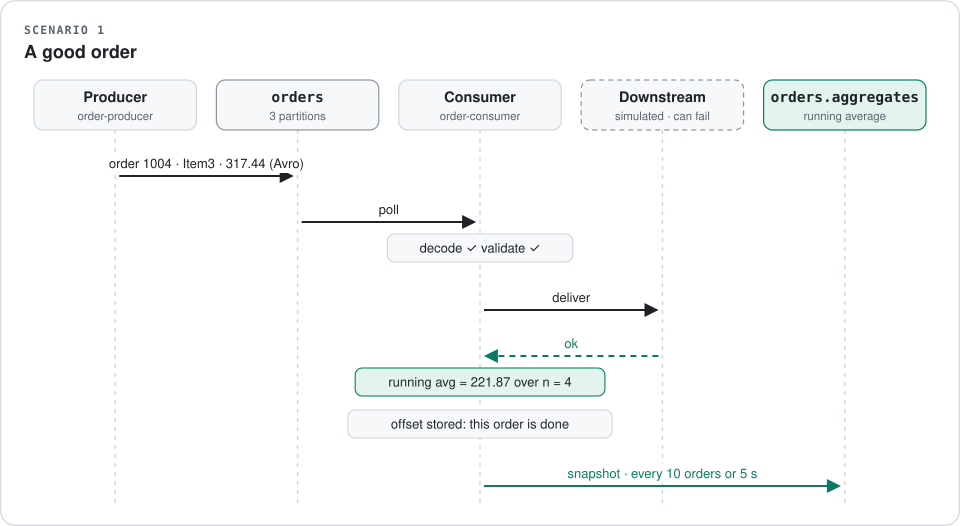
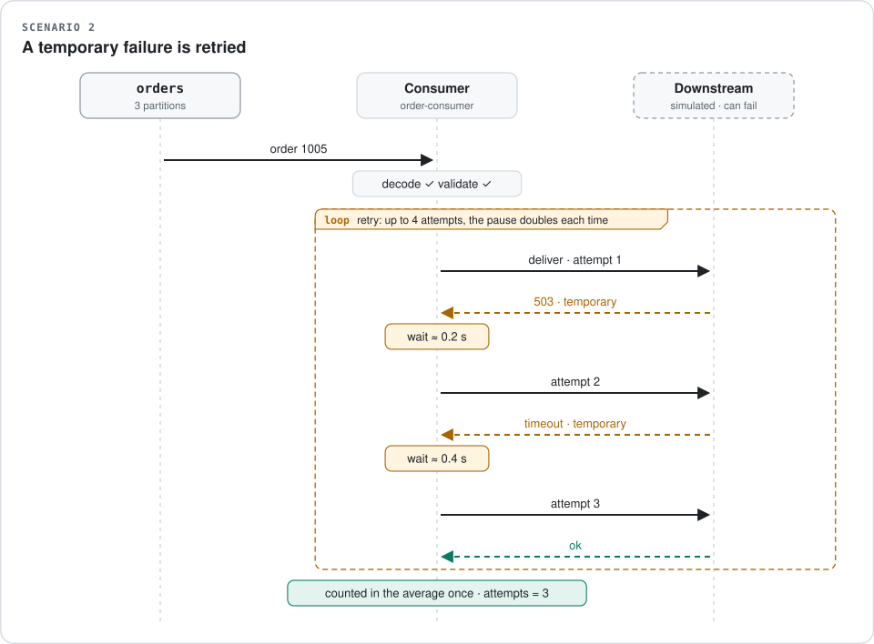
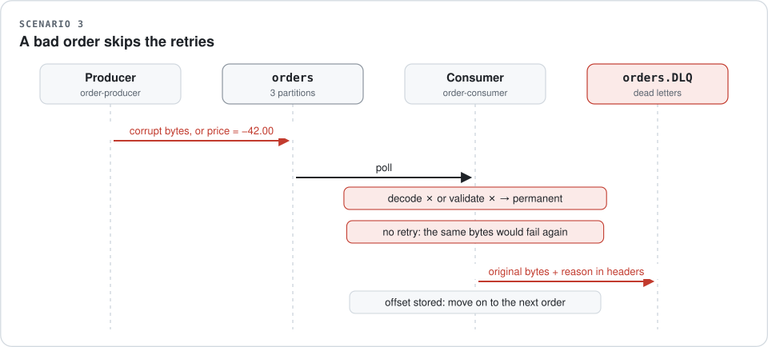
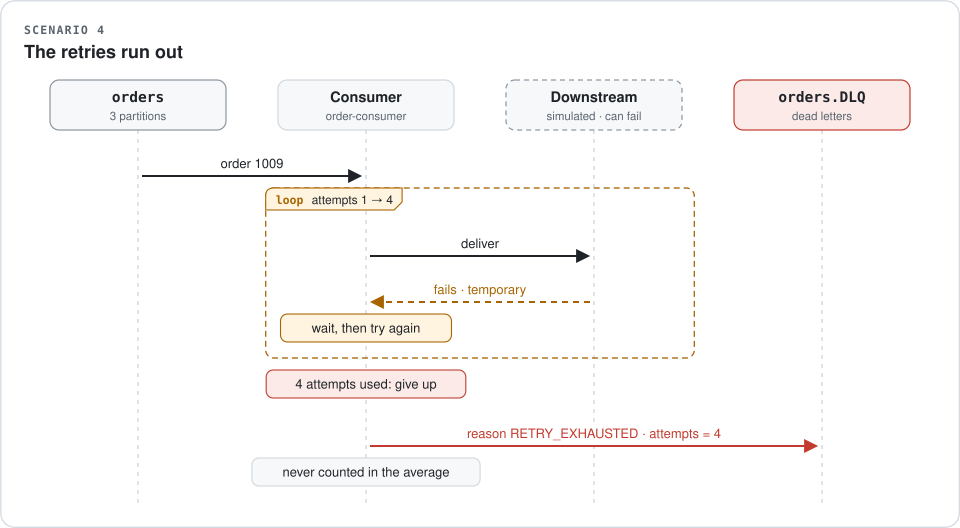
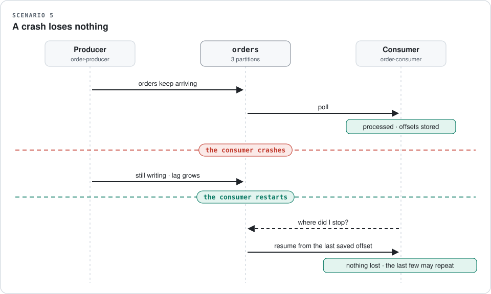

# EE8202 — Kafka Order Pipeline

A Kafka-based system that produces and consumes **order messages** serialised with
**Avro**, and that supports **real-time aggregation** (a running average of prices),
**retry logic** for temporary failures, and a **Dead Letter Queue** for messages that
can never succeed.

<p align="center">
  <picture>
    <source media="(prefers-color-scheme: dark)" srcset="docs/images/architecture-dark.svg">
    
  </picture>
</p>

## How it works

Think of an online shop. Every purchase creates an **order**: an ID, a product and a
price. This project passes those orders through Kafka and keeps a live average of the
prices.

Read the diagram above from left to right. **Teal** means an order was processed,
**red** means it failed, and **amber** means it is being retried.

1. **The producer** plays the shop. It creates orders and puts them on the `orders`
   *topic* — think of a conveyor belt that also keeps a record of everything that has
   passed along it. Each order is packed in **Avro**, a compact format that follows a
   fixed template. The template is stored in the **Schema Registry**, so everyone who
   reads an order unpacks it the same way.
2. **The consumer** takes orders off the belt one at a time and puts each through four
   steps: unpack it, check it, hand it to the next system, and count it.
3. **A good order** updates the running average.
4. **An order that can never work** — scrambled bytes, or a negative price — goes
   straight to a separate belt, the **dead letter queue**, with a note saying what was
   wrong.
5. **An order that failed for a temporary reason** — the next system was briefly
   down — is **retried**, with a longer pause before each attempt. If it keeps
   failing, it is dead-lettered too.

The producer mixes in bad orders on purpose, so that every one of these paths can be
seen working. [Section 5](#5-scenarios-step-by-step) walks through each path with a
diagram, and the [glossary](#10-glossary) explains the Kafka terms.

**Contents** — [Requirements](#1-requirements) ·
[Quick start](#2-quick-start) ·
[What you will see](#3-what-you-will-see) ·
[Requirement mapping](#4-how-each-assignment-requirement-is-met) ·
[Scenarios](#5-scenarios-step-by-step) ·
[Configuration](#6-configuration) ·
[Testing](#7-testing) ·
[Layout](#8-repository-layout) ·
[Troubleshooting](#9-troubleshooting) ·
[Glossary](#10-glossary)

---

## 1. Requirements

| Tool | Version | Why |
|---|---|---|
| Docker Desktop | 4.x with Compose v2 | runs Kafka, Schema Registry and Kafka UI |
| Python | 3.11 or newer | the producer and consumer |

Nothing else needs installing — no local Kafka, no ZooKeeper (the broker runs in KRaft mode).

## 2. Quick start

```bash
# 1. Bring up Kafka, the Schema Registry, the topics and the web UI
docker compose up -d

# 2. Install the pipeline (a virtual environment is strongly recommended)
python -m venv .venv
.venv/Scripts/activate          # Windows PowerShell: .venv\Scripts\Activate.ps1
                                # macOS / Linux:      source .venv/bin/activate
pip install -e ".[dev]"

# 3. Terminal A — start the consumer
order-consumer

# 4. Terminal B — start the producer
order-producer --rate 2

# 5. Terminal C — see what failed permanently
order-dlq
```

Stop the stack with `docker compose down` (add `-v` to also discard the Kafka data volume).

> **Windows note.** `order-consumer` and friends are installed into
> `.venv\Scripts\`. If the console scripts are not on your `PATH`, the equivalent
> `python -m order_pipeline.apps.consumer` always works.

## 3. What you will see

The consumer prints the running average after every successfully processed order:

```
10:14:02 INFO    order_pipeline.consumer  processed 1004   Item3      317.44 (attempts=1) | running avg=221.87 over n=4 [min=63.10 max=317.44] | Item1=63.10(n=1) Item3=301.25(n=3)
10:14:03 WARNING order_pipeline.processing order 1005 failed transiently on attempt 1/4 (simulated downstream outage while delivering order 1005); retrying in 0.18s
10:14:03 INFO    order_pipeline.consumer  processed 1005   Item2      88.90 (attempts=2) | running avg=195.28 over n=5 ...
10:14:05 ERROR   order_pipeline.dlq       dead-lettered orders[1]@12 after 1 attempt(s) - DESERIALIZATION_FAILURE: could not decode Avro payload: ...
10:14:06 INFO    order_pipeline.consumer  AGGREGATE  running avg=201.44 over n=10 [min=12.75 max=489.02] | ...
```

Browse the topics, the messages and the registered schemas at **<http://localhost:8080>**
(Kafka UI). The Schema Registry REST API is at **<http://localhost:8081>**.

## 4. How each assignment requirement is met

| Requirement | Where it lives | How |
|---|---|---|
| **Avro serialisation** | [schemas/order.avsc](schemas/order.avsc), [serdes.py](src/order_pipeline/serdes.py) | Confluent `AvroSerializer` / `AvroDeserializer` against the Schema Registry. The `.avsc` file is read at runtime, so the registered schema can never drift from the submitted file. |
| **Real-time aggregation** | [aggregation.py](src/order_pipeline/aggregation.py) | A running average maintained per message with **Welford's online algorithm** — O(1) memory, numerically stable over a long stream. Global *and* per-product, logged live and published to `orders.aggregates`. |
| **Retry logic** | [retry.py](src/order_pipeline/retry.py), [processing.py](src/order_pipeline/processing.py) | Bounded **exponential backoff with jitter**. Only *transient* errors are retried; permanent ones fail fast so they cannot block the partition. |
| **Dead Letter Queue** | [dlq.py](src/order_pipeline/dlq.py) | Failed messages are copied to `orders.DLQ` **byte-for-byte**, with the failure reason, error class, message, attempt count and origin coordinates in Kafka headers. |
| **Live demonstration** | [docs/DEMO.md](docs/DEMO.md) | A scripted walk-through with the exact commands and what to point at. |
| **Git repository** | this repo | Conventional commits, CI on every push, no generated artefacts committed. |

## 5. Scenarios, step by step

Each diagram follows one order through the system, top to bottom. The columns are the programs and topics involved; the arrows are messages passing between them.

### Scenario 1 — a good order

The order is unpacked, checked, handed to the next system and counted, so the running average moves. Only then is its offset stored, marking it done. Every ten orders, or every five seconds, the current average is also published to `orders.aggregates`.

<p align="center">
  <picture>
    <source media="(prefers-color-scheme: dark)" srcset="docs/images/scenario-1-happy-path-dark.svg">
    
  </picture>
</p>

### Scenario 2 — a temporary failure is retried

The next system is briefly unavailable. The consumer waits and tries again, doubling the pause each time, with a little randomness so that many retries do not all land at once. When delivery succeeds, the order is counted exactly once.

<p align="center">
  <picture>
    <source media="(prefers-color-scheme: dark)" srcset="docs/images/scenario-2-retry-dark.svg">
    
  </picture>
</p>

### Scenario 3 — a bad order skips the retries

Bytes that are not Avro, or a price below zero, can never succeed, however many times they are tried. Retrying would only hold up the orders queued behind it, so the message goes straight to the dead letter queue, untouched, with the reason recorded alongside it.

<p align="center">
  <picture>
    <source media="(prefers-color-scheme: dark)" srcset="docs/images/scenario-3-bad-order-dark.svg">
    
  </picture>
</p>

### Scenario 4 — the retries run out

If the next system stays down, the consumer gives up after four attempts and dead-letters the order with the reason `RETRY_EXHAUSTED`. A failed order is never counted in the average.

<p align="center">
  <picture>
    <source media="(prefers-color-scheme: dark)" srcset="docs/images/scenario-4-retries-exhausted-dark.svg">
    
  </picture>
</p>

### Scenario 5 — a crash loses nothing

An order is only marked done once the consumer has finished with it. After a crash, the consumer picks up from the last position it saved: nothing is lost, although the last few orders may be processed a second time. This guarantee is called *at-least-once* delivery.

<p align="center">
  <picture>
    <source media="(prefers-color-scheme: dark)" srcset="docs/images/scenario-5-crash-resume-dark.svg">
    
  </picture>
</p>

### Failure handling at a glance

Every failure is classified before anything else happens, because the classification —
not the exception type from some library — decides what the consumer does:

| Failure | Example | Retried? | Ends up |
|---|---|---|---|
| `DeserializationError` | corrupt bytes, unknown schema id | **No** — the bytes on disk will not change | `orders.DLQ`, reason `DESERIALIZATION_FAILURE` |
| `ValidationError` | negative price, blank `orderId` | **No** — retrying cannot fix bad data | `orders.DLQ`, reason `VALIDATION_FAILURE` |
| `TransientProcessingError` | downstream timeout / 503 | **Yes**, up to `CONSUMER_MAX_RETRY_ATTEMPTS` | processed, or `orders.DLQ` with reason `RETRY_EXHAUSTED` |

Two details that matter:

* **The DLQ write is flushed before the offset advances.** A message is only
  acknowledged once it is safely *somewhere* — processed or dead-lettered.
* **Offsets are stored manually** (`enable.auto.offset.store=false`), giving
  at-least-once semantics: a crash mid-message replays it rather than losing it.

### Replaying a dead letter

Because the DLQ payload is byte-identical to the original, a fixed message can be
replayed by copying its value straight back to `orders` — no re-encoding needed.
Inspect the queue first:

```bash
order-dlq                 # drain and print everything, then exit
order-dlq --follow        # stay attached and print new failures as they arrive
```

## 6. Configuration

Every setting has a working default, so the system runs with no configuration at all.
To change something, copy [.env.example](.env.example) to `.env`, or set the
environment variable directly. The most useful ones:

| Variable | Default | Meaning |
|---|---|---|
| `KAFKA_BOOTSTRAP_SERVERS` | `localhost:29092` | use `kafka:9092` from inside Docker |
| `KAFKA_SCHEMA_REGISTRY_URL` | `http://localhost:8081` | Schema Registry endpoint |
| `PRODUCER_INVALID_PAYLOAD_RATE` | `0.05` | share of business-invalid orders injected |
| `PRODUCER_CORRUPT_PAYLOAD_RATE` | `0.03` | share of non-Avro payloads injected |
| `CONSUMER_MAX_RETRY_ATTEMPTS` | `4` | total attempts per message, including the first |
| `CONSUMER_TRANSIENT_FAILURE_RATE` | `0.15` | simulated flakiness of the downstream sink |

All of these are also available as CLI flags — run any command with `--help`.

## 7. Testing

The domain core (models, retry policy, aggregation, DLQ routing) has **no Kafka
dependency**, so the whole failure matrix is covered by fast unit tests that need
no broker:

```bash
pytest                      # ~1s, no infrastructure required
pytest --cov                # with a coverage report
ruff check . && ruff format --check .
mypy
```

## 8. Repository layout

```
.
├── docker-compose.yml          Kafka (KRaft) + Schema Registry + Kafka UI + topic init
├── Dockerfile                  multi-stage image for the producer/consumer
├── schemas/
│   ├── order.avsc              the assignment schema — orderId, product, price
│   └── order_aggregate.avsc    running-average snapshots
├── scripts/create-topics.sh    explicit topic creation (auto-create is off)
├── src/order_pipeline/
│   ├── aggregation.py          running average (Welford)
│   ├── config.py               typed settings from env/.env
│   ├── dlq.py                  dead letter publication + failure headers
│   ├── errors.py               the transient/permanent error taxonomy
│   ├── models.py               Order + business rules
│   ├── processing.py           validate → retry → aggregate
│   ├── retry.py                exponential backoff with jitter
│   ├── schemas.py              .avsc loading
│   ├── serdes.py               Avro serialisers bound to the Schema Registry
│   ├── shutdown.py             graceful SIGINT/SIGTERM handling
│   └── apps/
│       ├── producer.py         order-producer
│       ├── consumer.py         order-consumer
│       └── dlq_inspector.py    order-dlq
├── tests/                      unit tests (no broker needed)
└── docs/
    ├── images/                 architecture and scenario diagrams (SVG)
    ├── assignment.pdf          the brief
    ├── ARCHITECTURE.md         design decisions and trade-offs
    └── DEMO.md                 the live demonstration script
```

## 9. Troubleshooting

| Symptom | Fix |
|---|---|
| `Connection refused` on `localhost:29092` | the broker is still starting — `docker compose ps` should show `kafka` as `healthy` |
| `Topic orders not present in metadata` | topic creation failed: `docker compose logs kafka-init` |
| Schema Registry 404s | it starts after Kafka; wait for `docker compose ps` to show it `healthy` |
| Consumer sits idle | it is at the end of the topic — start the producer, or restart with `--group fresh-$RANDOM` to re-read from the beginning |

## 10. Glossary

| Term | In plain words |
|---|---|
| **Producer** | The program that writes messages. Here it plays the shop, creating orders. |
| **Consumer** | The program that reads messages and does something with them. |
| **Topic** | A named, ordered list of messages that Kafka stores, like a conveyor belt that keeps a record. |
| **Partition** | A topic is split into lanes so the work can be shared out. `orders` has three. Messages stay in order within a lane. |
| **Offset** | A message's position in its lane. The consumer saves the offset it has finished up to, so it knows where to carry on. |
| **Consumer lag** | How many messages are waiting to be read. |
| **Avro** | A compact binary format that follows a strict template, used here instead of JSON. |
| **Schema / Schema Registry** | The template for a message, and the service that stores templates and gives each one an ID. |
| **Transient failure** | A failure that may go away if you try again, such as a timeout. |
| **Permanent failure** | A failure that never will, such as a negative price. |
| **Backoff** | Waiting a little longer before each new attempt, so a struggling system gets room to recover. |
| **Dead letter queue (DLQ)** | Where messages that cannot be processed are parked, with the reason, so they can be inspected and replayed later. |
| **At-least-once** | Nothing is ever lost. The trade-off is that, after a crash, a message may occasionally be processed twice. |
