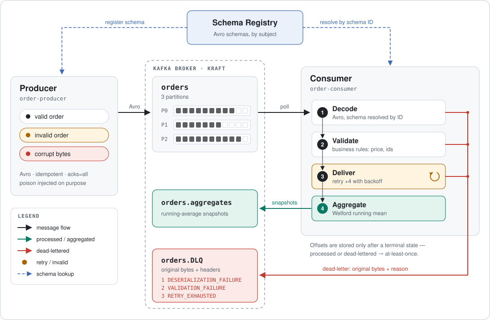

# EE8202 — Kafka Order Pipeline

A Kafka-based system that produces and consumes **order messages** serialised with
**Avro**, and that supports **real-time aggregation** (a running average of prices),
**retry logic** for temporary failures, and a **Dead Letter Queue** for messages that
can never succeed.

<p align="center">
  <picture>
    <source media="(prefers-color-scheme: dark)" srcset="docs/images/architecture-dark.svg">
    
  </picture>
</p>

---

## 1. Requirements

| Tool | Version | Why |
|---|---|---|
| Docker Desktop | 4.x with Compose v2 | runs Kafka, Schema Registry and Kafka UI |
| Python | 3.11 or newer | the producer and consumer |

Nothing else needs installing — no local Kafka, no ZooKeeper (the broker runs in KRaft mode).

## 2. Quick start

```bash
# 1. Bring up Kafka, the Schema Registry, the topics and the web UI
docker compose up -d

# 2. Install the pipeline (a virtual environment is strongly recommended)
python -m venv .venv
.venv/Scripts/activate          # Windows PowerShell: .venv\Scripts\Activate.ps1
                                # macOS / Linux:      source .venv/bin/activate
pip install -e ".[dev]"

# 3. Terminal A — start the consumer
order-consumer

# 4. Terminal B — start the producer
order-producer --rate 2

# 5. Terminal C — see what failed permanently
order-dlq
```

Stop the stack with `docker compose down` (add `-v` to also discard the Kafka data volume).

> **Windows note.** `order-consumer` and friends are installed into
> `.venv\Scripts\`. If the console scripts are not on your `PATH`, the equivalent
> `python -m order_pipeline.apps.consumer` always works.

## 3. What you will see

The consumer prints the running average after every successfully processed order:

```
10:14:02 INFO    order_pipeline.consumer  processed 1004   Item3      317.44 (attempts=1) | running avg=221.87 over n=4 [min=63.10 max=317.44] | Item1=63.10(n=1) Item3=301.25(n=3)
10:14:03 WARNING order_pipeline.processing order 1005 failed transiently on attempt 1/4 (simulated downstream outage while delivering order 1005); retrying in 0.18s
10:14:03 INFO    order_pipeline.consumer  processed 1005   Item2      88.90 (attempts=2) | running avg=195.28 over n=5 ...
10:14:05 ERROR   order_pipeline.dlq       dead-lettered orders[1]@12 after 1 attempt(s) - DESERIALIZATION_FAILURE: could not decode Avro payload: ...
10:14:06 INFO    order_pipeline.consumer  AGGREGATE  running avg=201.44 over n=10 [min=12.75 max=489.02] | ...
```

Browse the topics, the messages and the registered schemas at **<http://localhost:8080>**
(Kafka UI). The Schema Registry REST API is at **<http://localhost:8081>**.

## 4. How each assignment requirement is met

| Requirement | Where it lives | How |
|---|---|---|
| **Avro serialisation** | [schemas/order.avsc](schemas/order.avsc), [serdes.py](src/order_pipeline/serdes.py) | Confluent `AvroSerializer` / `AvroDeserializer` against the Schema Registry. The `.avsc` file is read at runtime, so the registered schema can never drift from the submitted file. |
| **Real-time aggregation** | [aggregation.py](src/order_pipeline/aggregation.py) | A running average maintained per message with **Welford's online algorithm** — O(1) memory, numerically stable over a long stream. Global *and* per-product, logged live and published to `orders.aggregates`. |
| **Retry logic** | [retry.py](src/order_pipeline/retry.py), [processing.py](src/order_pipeline/processing.py) | Bounded **exponential backoff with jitter**. Only *transient* errors are retried; permanent ones fail fast so they cannot block the partition. |
| **Dead Letter Queue** | [dlq.py](src/order_pipeline/dlq.py) | Failed messages are copied to `orders.DLQ` **byte-for-byte**, with the failure reason, error class, message, attempt count and origin coordinates in Kafka headers. |
| **Live demonstration** | [docs/DEMO.md](docs/DEMO.md) | A scripted walk-through with the exact commands and what to point at. |
| **Git repository** | this repo | Conventional commits, CI on every push, no generated artefacts committed. |

## 5. Failure handling in detail

Every failure is classified before anything else happens, because the classification —
not the exception type from some library — decides what the consumer does:

| Failure | Example | Retried? | Ends up |
|---|---|---|---|
| `DeserializationError` | corrupt bytes, unknown schema id | **No** — the bytes on disk will not change | `orders.DLQ`, reason `DESERIALIZATION_FAILURE` |
| `ValidationError` | negative price, blank `orderId` | **No** — retrying cannot fix bad data | `orders.DLQ`, reason `VALIDATION_FAILURE` |
| `TransientProcessingError` | downstream timeout / 503 | **Yes**, up to `CONSUMER_MAX_RETRY_ATTEMPTS` | processed, or `orders.DLQ` with reason `RETRY_EXHAUSTED` |

Two details that matter:

* **The DLQ write is flushed before the offset advances.** A message is only
  acknowledged once it is safely *somewhere* — processed or dead-lettered.
* **Offsets are stored manually** (`enable.auto.offset.store=false`), giving
  at-least-once semantics: a crash mid-message replays it rather than losing it.

### Replaying a dead letter

Because the DLQ payload is byte-identical to the original, a fixed message can be
replayed by copying its value straight back to `orders` — no re-encoding needed.
Inspect the queue first:

```bash
order-dlq                 # drain and print everything, then exit
order-dlq --follow        # stay attached and print new failures as they arrive
```

## 6. Configuration

Every setting has a working default, so the system runs with no configuration at all.
To change something, copy [.env.example](.env.example) to `.env`, or set the
environment variable directly. The most useful ones:

| Variable | Default | Meaning |
|---|---|---|
| `KAFKA_BOOTSTRAP_SERVERS` | `localhost:29092` | use `kafka:9092` from inside Docker |
| `KAFKA_SCHEMA_REGISTRY_URL` | `http://localhost:8081` | Schema Registry endpoint |
| `PRODUCER_INVALID_PAYLOAD_RATE` | `0.05` | share of business-invalid orders injected |
| `PRODUCER_CORRUPT_PAYLOAD_RATE` | `0.03` | share of non-Avro payloads injected |
| `CONSUMER_MAX_RETRY_ATTEMPTS` | `4` | total attempts per message, including the first |
| `CONSUMER_TRANSIENT_FAILURE_RATE` | `0.15` | simulated flakiness of the downstream sink |

All of these are also available as CLI flags — run any command with `--help`.

## 7. Testing

The domain core (models, retry policy, aggregation, DLQ routing) has **no Kafka
dependency**, so the whole failure matrix is covered by fast unit tests that need
no broker:

```bash
pytest                      # ~1s, no infrastructure required
pytest --cov                # with a coverage report
ruff check . && ruff format --check .
mypy
```

## 8. Repository layout

```
.
├── docker-compose.yml          Kafka (KRaft) + Schema Registry + Kafka UI + topic init
├── Dockerfile                  multi-stage image for the producer/consumer
├── schemas/
│   ├── order.avsc              the assignment schema — orderId, product, price
│   └── order_aggregate.avsc    running-average snapshots
├── scripts/create-topics.sh    explicit topic creation (auto-create is off)
├── src/order_pipeline/
│   ├── aggregation.py          running average (Welford)
│   ├── config.py               typed settings from env/.env
│   ├── dlq.py                  dead letter publication + failure headers
│   ├── errors.py               the transient/permanent error taxonomy
│   ├── models.py               Order + business rules
│   ├── processing.py           validate → retry → aggregate
│   ├── retry.py                exponential backoff with jitter
│   ├── schemas.py              .avsc loading
│   ├── serdes.py               Avro serialisers bound to the Schema Registry
│   ├── shutdown.py             graceful SIGINT/SIGTERM handling
│   └── apps/
│       ├── producer.py         order-producer
│       ├── consumer.py         order-consumer
│       └── dlq_inspector.py    order-dlq
├── tests/                      unit tests (no broker needed)
└── docs/
    ├── assignment.pdf          the brief
    ├── ARCHITECTURE.md         design decisions and trade-offs
    └── DEMO.md                 the live demonstration script
```

## 9. Troubleshooting

| Symptom | Fix |
|---|---|
| `Connection refused` on `localhost:29092` | the broker is still starting — `docker compose ps` should show `kafka` as `healthy` |
| `Topic orders not present in metadata` | topic creation failed: `docker compose logs kafka-init` |
| Schema Registry 404s | it starts after Kafka; wait for `docker compose ps` to show it `healthy` |
| Consumer sits idle | it is at the end of the topic — start the producer, or restart with `--group fresh-$RANDOM` to re-read from the beginning |
